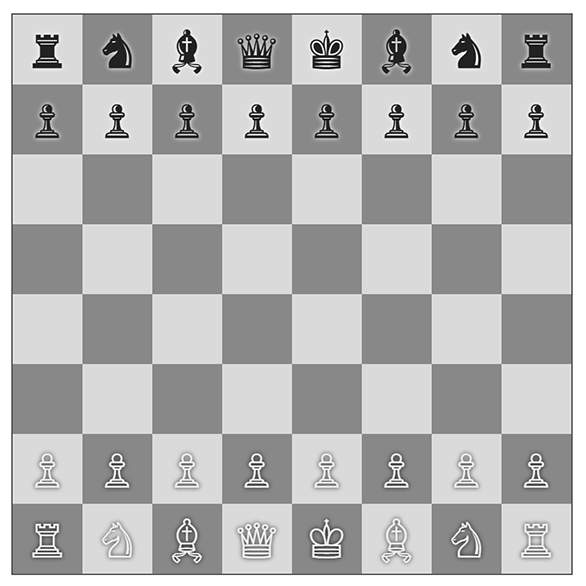
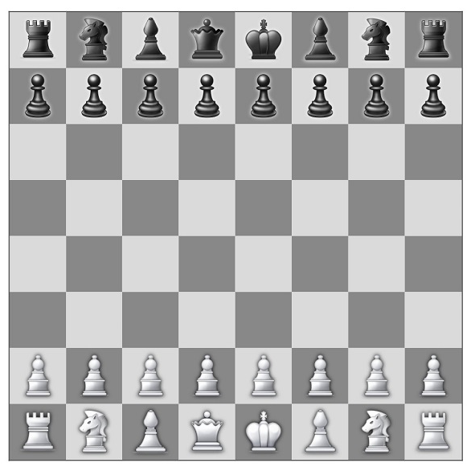

chess-js
=======

The chess game everyone knows and loves, in vanilla JavaScript. [Try it out!](https://atomk.github.io/chess-js/)

## Features
- Chess variants (6x6, 5x5)
- Basic AI
- Basic pawn promotion (always promoted to queens)

## Notes

- The icons used for the pieces are just [Unicode characters](https://en.wikipedia.org/wiki/Chess_symbols_in_Unicode), they may look different depending on your device/browser. By [default]((https://emojipedia.org/emoji/%E2%99%9F/)) they _should_ be displayed as text. Most systems have only an emoji for the pawn, Samsung created an emoji for every single piece. On Microsoft Edge you'll see only the pawn displayed as emoji and the other pieces as text. On Chrome everything seems to work the way it is intended.

    | Windows 10 (Chrome) | Samsung |
    | --- | --- |
    |  |  |

- I used mostly ES6 features (arrow functions, let, const, class, template strings) without using any transpiler, which means some old browsers like Internet Explorer are not supported.

## Mistakes
- Just "going with the flow", not planning many things ahead. This approach is more fun since things are discovered and done step-by-step, but as the project got bigger I realized how planning things ahead would have saved a few of hours of refactoring.
- Not using classes from the start, or at least modules, to separate responsibilities. I ended up with almost 1000 lines of code in the same scope, a bit of organization is necessary to keep things manageable.

## To-do
- Button to restart game on gameover (stalemate, checkmate), with same settings
- Start game without menu, let user open the menu during play
- Use a `<select>` for the chessboard selection
- Improve styling (font, chessboard colors, menu...)
- Decouple Chess class from UI functions
- SVG icons for more consistency across browsers
- https://en.wikipedia.org/wiki/Promotion_(chess)
- https://en.wikipedia.org/wiki/Castling
- https://en.wikipedia.org/wiki/En_passant
- Make Ai wait a moment before doing its move
- Highlight last moved piece
- Undo
- Timer
- Tests!
- Simple NodeJS PvP server